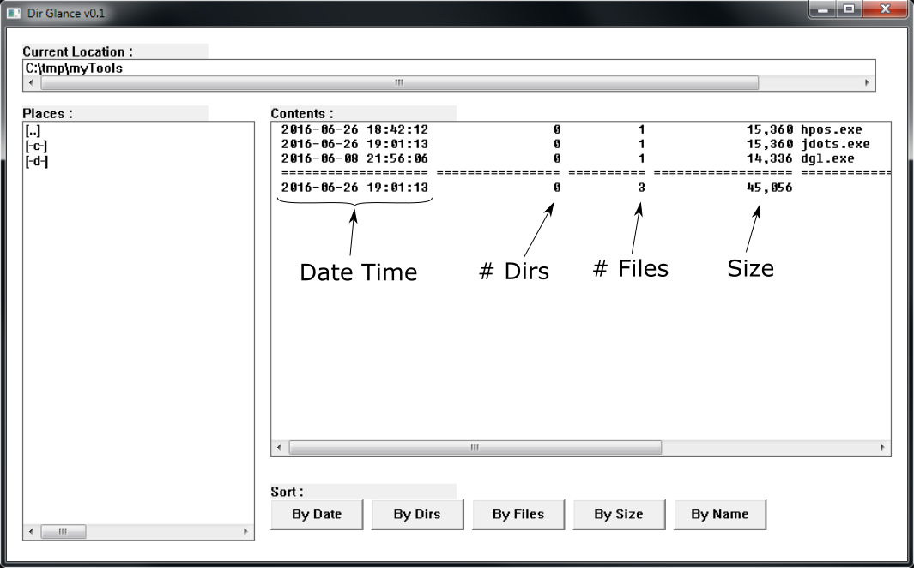

# Dir Glance

Tool implemented in C using Win32 System Calls to list the contents of the current working directory along with the time stamps and size of all its entries including subdirectories.

This project was compiled using Visual Studio 2010 on Windows 7.

Please note that the GUI itself is still a work in progress and may look unpolished, however the application is functional and stable.

## Main Window Explained

## Usage
The **Current Location** field shows the current working directory.

The subdirectories, shortcuts to the parent directory and other drives found on the system are shown on the **Places** panel.

The **Contents** panel shows all the details of the subdirectories and files found on the current working directory.

## Inner Workings
Every time a new working directory is selected, it is scanned on a separate thread so that the GUI thread remains responsive.

In the case that a subdirectory is discovered, the scanning function is called recursively until no new levels can be reached, returning the total amount and size of all the files and subdirectories found.

The final results of the scan are saved on a linked list, which allows for its fast sorting and presentation.